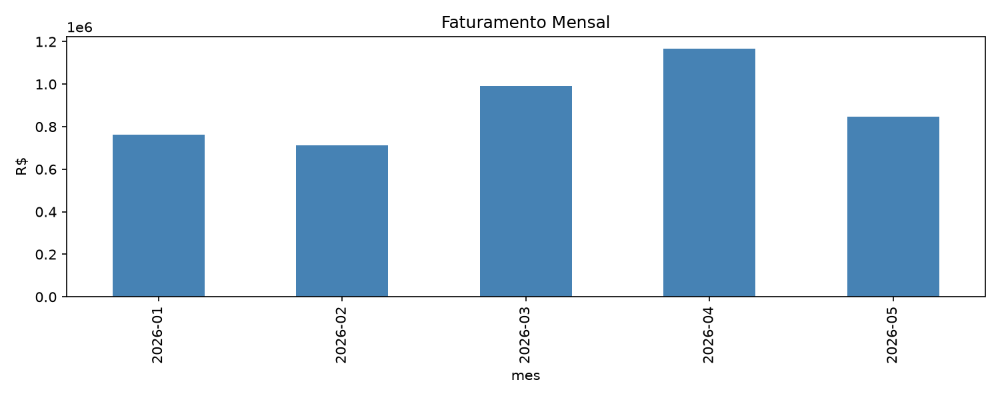
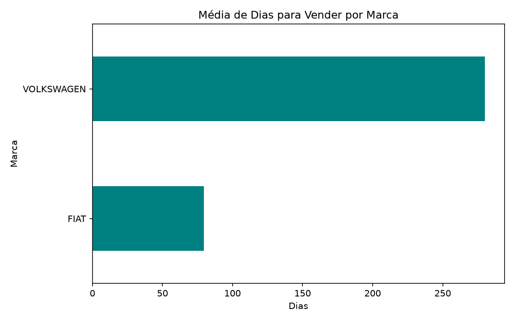

# Análise de Vendas e Giro de Estoque - Revenda Mais

Este projeto apresenta uma análise descritiva completa sobre o faturamento mensal e o giro de estoque de uma concessionária de veículos seminovos. O objetivo principal é transformar dados brutos em inteligência de negócios para otimizar o fluxo de pátio e identificar gargalos financeiros.

## 🛠️ Tecnologias Utilizadas
* **Python** para tratamento de dados estruturados.
* **Pandas** para limpeza, conversão de formatos de dados e manipulação de tabelas.
* **Matplotlib** para a construção e exportação de gráficos de alta qualidade.
* **Jupyter Lab** como ambiente de desenvolvimento e documentação interativa.

---

## 📈 Principais Insights Gerados

### 1. Faturamento Recorde Mensal
O mês com maior faturamento foi **abril de 2026 (2026-04)**, alcançando a marca de **R$ 1.166.600,00**. 

No gráfico abaixo, podemos visualizar a tendência e o comportamento do faturamento de vendas ao longo dos meses:

---

### 2. Eficiência de Pátio e Giro de Estoque
A marca **FIAT** apresentou o melhor giro de estoque, mantendo os veículos no pátio por uma média de apenas **79.7 dias**. Em contrapartida, marcas menos ágeis no pátio geram um custo operacional maior por veículo parado.

Veja a comparação de tempo de pátio por montadora:

---

### 3. Modelos Mais Vendidos
Os carros com maior saída e liquidez no período analisado foram:
1. **ARGO DRIVE 1.0** (4 vendas)
2. **RENEGADE LNGTD AT** (4 vendas)
3. **STRADA FREEDOM 13CS** (3 vendas)

---
*Análise desenvolvida por Wesley Francisco Carneiro.*
